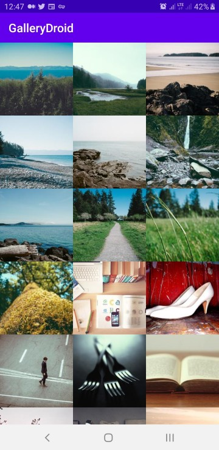
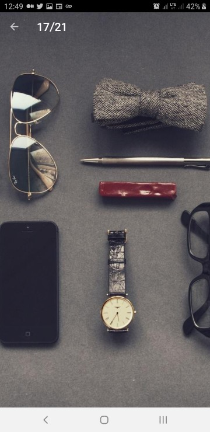

☘ GalleryDroid
=======

A simple and useful Android Gallery.

[](https://jitpack.io/#jdsdhp/gallerydroid) 
[](https://android-arsenal.com/api?level=17) 
[](https://github.com/jdsdhp/gallerydroid/blob/master/LICENSE) 
[](https://twitter.com/jdsdhp)

## Including in your project

#### Gradle

```gradle
allprojects  {
    repositories {
        ...
        maven { url 'https://jitpack.io' }
    }
}
dependencies {
    implementation 'com.github.jdsdhp:gallerydroid:$version'
}
```

## Basic Usage
Gallery Screen|Picture Screen |Inmersive Screen
:-:|:-:|:-:
 |  | 

#### Kotlin
Images in this example have been loaded from [Lorem Picsum](https://picsum.photos).

Usage from Activity or Fragment.  Se añade normalmente el fragment (GalleryFragment) mediante una transición o directamente desde XML.
```kotlin
supportFragmentManager.beginTransaction()
            .setTransition(FragmentTransaction.TRANSIT_FRAGMENT_FADE) //Optional
            .replace(R.id.container, GalleryFragment.newInstance())
            .commit()
```
Solo falta añadirle elementos a la gallería. Se pude hacer mediante el método onAttachFragment en la Activity o Fragment donde se tiene a GalleryFragment.
```kotlin
override fun onAttachFragment(fragment: Fragment) {
        super.onAttachFragment(fragment)
        if (fragment is GalleryFragment) {
            fragment.injectGallery(
                GalleryDroid(
                    listOf(
                        Picture(
                            fileURL = "https://picsum.photos/id/15/720/1000",
                            fileThumbURL = "https://picsum.photos/id/15/200",
                            fileName = "Lorem Ipsum 1", //Optional
                        ),
                        Picture(
                            fileURL = "https://picsum.photos/id/16/720/1000",
                            fileThumbURL = "https://picsum.photos/id/16/200",
                            fileName = "Lorem Ipsum 2", //Optional
                        ),
                        Picture(
                            fileURL = "https://picsum.photos/id/14/720/1000",
                            fileThumbURL = "https://picsum.photos/id/14/200",
                            fileName = "Lorem Ipsum 3", //Optional
                        )
                    )
                )
            )
        }
    }
```
#### XML
Añade esto a tu archivo AndroidManifest.xml si estas usando la activity por defecto que provee la biblioteca. En caso de que se esté usando directamente GalleryFragment no sería necesario.
```xml
<activity
  android:name="com.jesusd0897.gallerydroid.view.activity.PictureDetailActivity"
  android:configChanges="orientation|screenSize"
  android:theme="@style/Theme.MaterialComponents.NoActionBar" />
```
## Advanced Usage
Custom Gallery|Custom Landscape Gallery|Custom Transformations
:-:|:-:|:-:
 |  | 
#### Kotlin
Sobrescribiendo onAttachFragment se le puede añadir algunas personalizaciones a la galería.
```kotlin
override fun onAttachFragment(fragment: Fragment) {
        super.onAttachFragment(fragment)
        if (fragment is GalleryFragment) {
            fragment.injectGallery(
                GalleryDroid(
                    //...your pictures
                )
                .loadingPlaceholder(
                    ContextCompat.getDrawable(this, R.drawable.ic_custom_loading_placeholder)
                )
                .errorPlaceholder(
                    ContextCompat.getDrawable(this, R.drawable.ic_custom_error_placeholder)
                )
                .pictureCornerRadius(16f)
                .pictureElevation(8f)
                .transformer(PageTransformer.FLIP_HORIZONTAL)
                .spacing(12)
                .portraitColumns(2)
                .landscapeColumns(4)
                .emptyTitle("Upps")
                .emptySubTitle(getString(R.string.no_items_found))
                .emptyIcon(ContextCompat.getDrawable(this, R.drawable.ic_round_find_in_page))
                .decoratorLayout(R.layout.custom_decorator)
                .autoClickHandler(true)
                .useLabels(false)
            )
        }
    }
```
##### Adding click listeners
Si se quiere escuchar los clicks en los elementos de la gallería se puede añadir un OnPictureItemClickListener al GalleryFragment. En caso de que se haya usado en true la propiedad "autoClickHandler" igualmente se abrirá PictureDetailActivity, para que esto no ocurra deberá ponerse en false. 
```kotlin
fragment.onItemClickListener = object : OnPictureItemClickListener {
                override fun onClick(picture: Picture, position: Int) {
                    Toast.makeText(this@MainActivity, "onClick = $picture", Toast.LENGTH_SHORT)
                        .show()
                }

                override fun onLongClick(picture: Picture, position: Int) {
                    Toast.makeText(this@MainActivity, "onLongClick = $picture", Toast.LENGTH_SHORT)
                        .show()
                }
            }
```
## Sample project

It's very important to check out the sample app. Most techniques that you would want to implement are already implemented in the examples.

View the sample app's source code [here](https://github.com/jdsdhp/gallerydroid/tree/master/app)

License
=======

    Copyright (c) 2020 jesusd0897.
    
    Licensed under the Apache License, Version 2.0 (the "License");
    you may not use this file except in compliance with the License.
    You may obtain a copy of the License at
    
        http://www.apache.org/licenses/LICENSE-2.0
    
    Unless required by applicable law or agreed to in writing, software
    distributed under the License is distributed on an "AS IS" BASIS,
    WITHOUT WARRANTIES OR CONDITIONS OF ANY KIND, either express or implied.
    See the License for the specific language governing permissions and
    limitations under the License.
